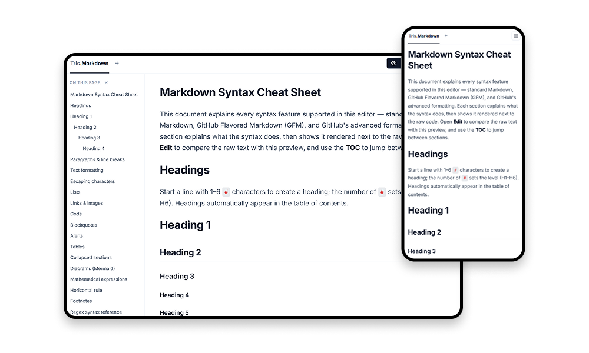

# Tris Markdown

A lightweight Markdown editor and previewer for writing, editing, and previewing Markdown in real time.

<a href="https://md.tris.work">
  <picture>
    <source
      media="(prefers-color-scheme: dark)"
      srcset="https://img.shields.io/badge/TRY_IT_HERE-FFFFFF?style=for-the-badge&logo=rocket&logoColor=000000"
    />
    
  </picture>
</a>

